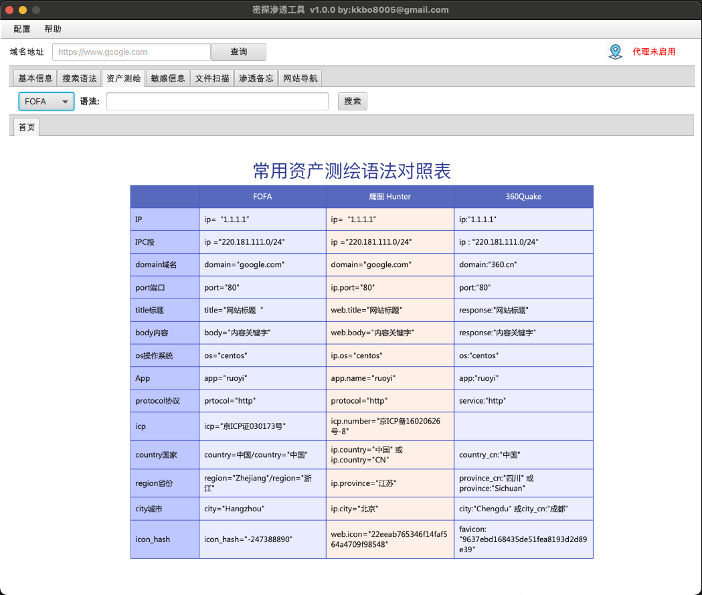

## 密探 -- 渗透工具-- 测试版     by: kkbo8005@gmail.com

### 1.缘起

  对于网络安全的小白来说，在渗透学习过程中太多的知识和技巧需要掌握，密探借鉴superSearchPlus (不会安全的开发)的，御剑文件扫描等工具，根据自己的理解和总结，开发这款“密探”渗透工具，希望能够为大家提供帮助。

### 2.功能介绍

  密探-主要包含域名信息查询，IP端口查询，备案信息查询，搜索引擎语法自动生成（**FOFA,Hunter,google,github**），资产测绘（**FOFA，hunter，quake** 的查询及结果导出），指纹识别、敏感信息（**暴露接口并可以自动探测未授权**），文件扫描（包含**目录，备份文件，spring信息泄漏，自定义字典**等）、渗透技能路线备忘录，常用网络安全网站导航等功能。

​       **本工具仅供安全测试人员运用于授权测试, 禁止用于未授权测试, 违者责任自负。作者不对您使用该工具所产生的任何后果负任何法律责任。**  

​       **本工具在扫描模块使用多线程，在测试过程中根据目标的实际情况进行调整，切勿进行大线程低延时的大规模快速扫描，以免对目标服务造成不利影响。**

### 3.更新日志

| 2024.4.24 | 界面功能增加指纹识别扫描模块，支持从资产测绘联动到指纹识别，从指纹识别联动敏感信息、文件扫描模块 |
| --------- | ------------------------------------------------------------ |
| 2024.4.20 | 增加资产测绘模块，调整界面布局，资产测绘支持fofa,hunter,quake3个引擎的查询，并支持右键菜单与敏感信息扫描、文件扫描模块的联动功能 |
| 2024.4.13 | 优化了接口未授权扫描的界面卡顿问题以及接口抓取完成自动触发接口未授权扫描计算bug |
| 2024.4.11 | 将敏感信息界面重构了，增加了接口抓取及未授权接口探测功能。（正则表达式感觉还不够完美，下一版再优化一下） |
| 2024.4.7  | 优化文件扫描的多线程扫描功能，增加网站导航地址               |

###  4.如何运行

 在jdk8环境下运行以下语句运行:

```
java -jar mitan-1.0-jar-with-dependencies.jar
```

运行成功显示以下界面：


​    新增资产测绘界面如下图：




### 5.互相交流

密探1.0版本比较粗糙，希望大家多多帮助，帮助完善提升。 密探渗透工具在开发过程中得到“长风安全”，“湘安无事“两个团队的师傅对工具的完善提供大量帮助，后续等待开发完成在团队内部测试后，提供免费下载使用。有更好的想法也可以➕V：kkbo680  进入密探用户交流群，提供宝贵意见。 


