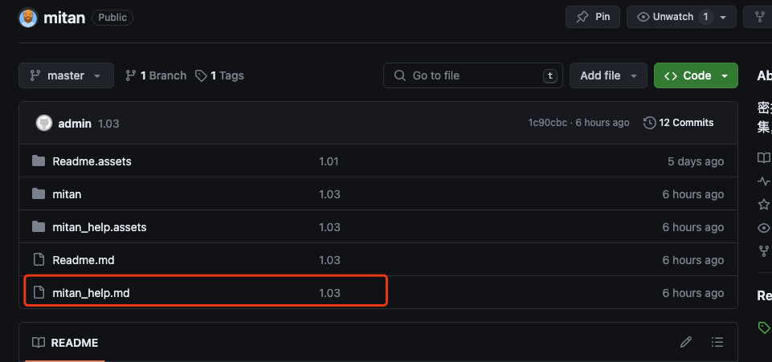

## 密探 -- 渗透工具 v1.03 测试版     by: kkbo8005@gmail.com

### 1.缘起

  对于网络安全的小白来说，在渗透学习过程中太多的知识和技巧需要掌握，密探借鉴superSearchPlus (不会安全的开发)的，御剑文件扫描等工具，根据自己的理解和总结，开发这款“密探”渗透工具，希望能够为大家提供帮助。

### 2.功能介绍

  密探-主要包含域名信息查询，IP端口查询，备案信息查询，敏感信息（**暴露接口并可以自动探测未授权**），搜索引擎语法自动生成（**FOFA,Hunter,google,github**），文件扫描（包含**目录，备份文件，spring信息泄漏，自定义字典**等）、渗透技能路线备忘录，常用网络安全网站导航等功能。

### 3.更新日志

| 2024.4.13     | 优化了接口未授权扫描的界面卡顿问题以及接口抓取完成自动触发接口未授权扫描触发的bug |
| ------------- | ------------------------------------------------------------ |
| **2024.4.11** | 将敏感信息界面重构了，增加了接口抓取及未授权接口探测功能。（正则表达式感觉还不够完美，下一版再优化一下） |
| **2024.4.7**  | 优化文件扫描的多线程扫描功能，增加网站导航地址               |

###  4.如何运行

 在jdk8环境下运行以下语句运行:

```
java -jar mitan-1.0-jar-with-dependencies.jar
```

运行成功显示以下界面：


​     更详细的操作说明请阅读“***==mitan_help.md==”*** 使用说明文档



### 5.互相交流

密探1.0版本比较粗糙，希望大家多多帮助，帮助完善提升。 密探渗透工具在开发过程中得到“长风安全”，“湘安无事“两个团队的师傅对工具的完善提供大量帮助，后续等待开发完成在团队内部测试后，提供免费下载使用。有更好的想法也可以➕V：kkbo680  提供宝贵意见。 

