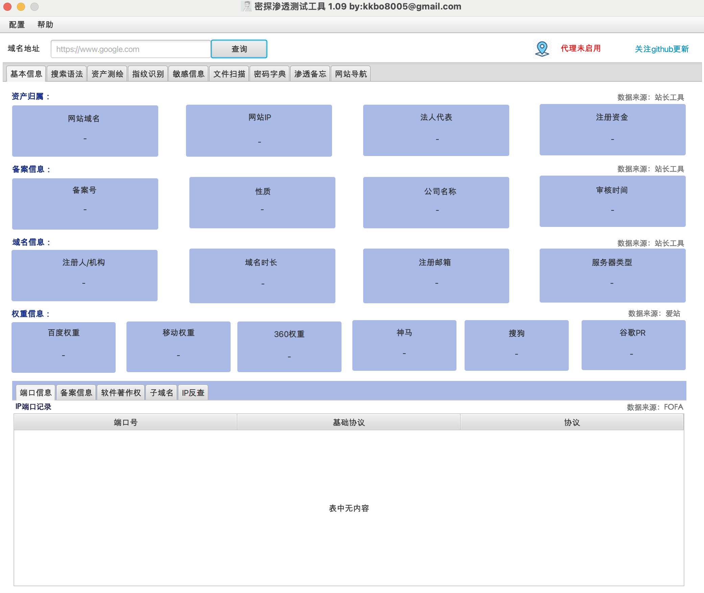
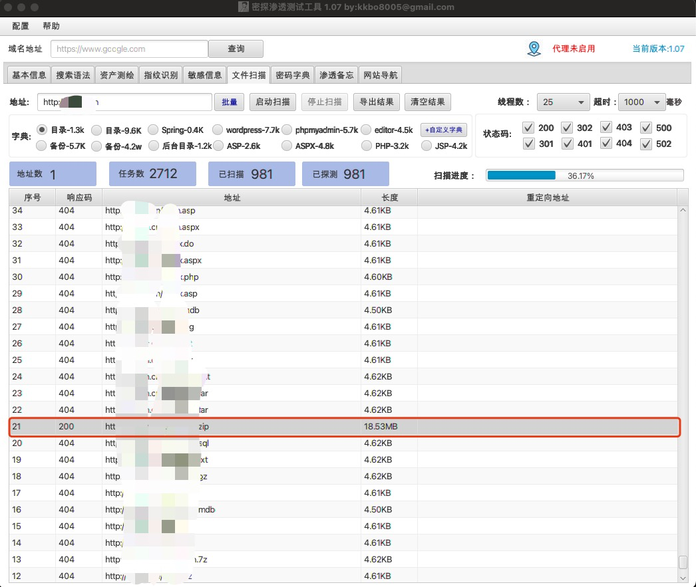

## 密探 -- 渗透测试工具 v1.10     by: kkbo8005@gmail.com

### 1.缘起

  对于学习网络安全的小白来说，在渗透实战过程中容易没有方向，密探借鉴FindSomeThing、SuperSearchPlus ，御剑文件扫描、dirsearch、JSFinder,fofaviewer等工具，开发这款“密探”渗透测试工具，希望能够为大家提供帮助，并向上述工具的开发者致敬！！

### 2.功能介绍

  密探-主要包含域名信息查询，IP端口查询，备案信息查询，搜索引擎语法自动生成（**FOFA,Hunter,google,github**），资产测绘（**FOFA，hunter，quake** 的查询及结果导出），指纹识别、敏感信息（**暴露接口并可以自动探测未授权**），文件扫描（包含**目录，备份文件，spring信息泄漏，自定义字典**等）、渗透技能路线备忘录，常用网络安全网站导航等功能。

​       **本工具仅供安全测试人员运用于授权测试, 禁止用于未授权测试, 违者责任自负。作者不对您使用该工具所产生的任何后果负任何法律责任。**  

​       **本工具在扫描模块使用多线程，在测试过程中根据目标的实际情况进行调整，切勿进行大线程低延时的大规模快速扫描，以免对目标服务造成不利影响。**

### 3.更新日志

| 2024.5.19 | 优化指纹识别的增加任务文件中包含多个空行导致的线程假死bug，增加状态码过滤，增加指纹识别去重，优化适当调整窗口高度，解决分辨率不够,看不全的问题，优化文件扫描，敏感信息的任务初始化操作步骤。修复文件接口扫描导出因返回包太大无法导出的bug，修复了资产测绘条件语句中包含保留词无法导出的bug，增加首页重要信息的复制功能。 |
| --------- | ------------------------------------------------------------ |
| 2024.5.15 | 增加了将工具里面的配置项保存到配置文件，启动加载功能，调整了资产测绘的导出方式，优化文件扫描过滤功能，优化了扫描线程BUG,优化主界面域名信息查询的正则表达式.优化quake注册会员、高级会员的domain查询字段的bug,优化了使用中的一些细节bug |
| 2024.5.8  | 修正使用中各位师傅提的bug，基本信息模块新增软件著作权，子域名，IP反查域名解析记录，资产测绘增加配置Hunter的多KEY轮询查询功能，文件目录扫描增加了按域名+压缩文件后缀的组合方式。 |
| 2024.5.6  | 增加权重信息查询，增加资产测绘的自动加载查询，优化指纹扫描，接口扫描，文件目录扫描功能，增加密码字典功能。优化网站导航信息 |
| 2024.4.24 | 界面功能增加指纹识别扫描模块，支持从资产测绘联动到指纹识别，从指纹识别联动敏感信息、文件扫描模块 |
| 2024.4.20 | 增加资产测绘模块，调整界面布局，资产测绘支持fofa,hunter,quake3个引擎的查询，并支持右键菜单与敏感信息扫描、文件扫描模块的联动功能 |
| 2024.4.13 | 优化了接口未授权扫描的界面卡顿问题以及接口抓取完成自动触发接口未授权扫描计算bug |
| 2024.4.11 | 将敏感信息界面重构了，增加了接口抓取及未授权接口探测功能。（正则表达式感觉还不够完美，下一版再优化一下） |
| 2024.4.7  | 优化文件扫描的多线程扫描功能，增加网站导航地址               |

###  4.如何运行

 在jdk8环境下运行以下语句运行:

```
java -jar mitan-jar-with-dependencies.jar
```

​	若不想输入这么长太长语句，可以通过以下脚本的方式启动：

1.   Mac/Linux 环境下，可以通过sh文件启动，需要在控制台窗口先给予**start.sh**权限。

```
chmod +x start.sh
```

赋予权限后，每次在控制台窗口执行如下命令打开工具

```
./start.sh
```

   2. windows系统直接双击"**start.bat**" 文件启动工具

      

运行成功显示以下界面：







### 5.常见问题

#### （1）运行时错误提示: 缺少 JavaFX 运行时组件的解决方法。

 **JavaFX 从 Java 11 开始从 JDK中移除，JDK11以上的需要单独下载和配置javaFx。**

##### 1. 下载 JavaFX SDK

首先，从 [Gluon](https://gluonhq.com/products/javafx/) 网站 下载对应操作系统的 JavaFX SDK。

##### 2. 解压到目录

将下载的 JavaFX SDK 解压到一个目录中（例如 `C:\javafx-sdk-21`）。

##### 3. 运行 JAR 文件时指定 JavaFX 模块路径

在运行你的 JAR 文件时，需要指定 JavaFX 模块的路径。假设你的 JavaFX SDK 解压在 `C:\javafx-sdk-21`，你可以使用以下命令来运行你的 JAR 文件：

```
java --module-path "C:\javafx-sdk-21\lib" --add-modules javafx.controls,javafx.fxml -jar mitan-jar-with-dependencies.jar
```

在这个命令中：

- `--module-path "C:\javafx-sdk-21\lib"` 指定了 JavaFX 模块的路径。

- `--add-modules javafx.controls,javafx.fxml` 添加了所需的 JavaFX 模块，根据你的应用程序可能需要添加其他模块。

  

  **感谢 p1at0x ，s0nd9r师傅在Issues中提出的解决方案，可自行根据操作系统修改start.bat或start.sh脚本文件，解决快速启动。**

  

#### （2） 若遇到界面乱码问题，建议指定编码方式进行启动。

```
java "-Dfile.encoding=UTF-8" -jar mitan-jar-with-dependencies.jar
```

 **可自行根据操作系统修改start.bat或start.sh脚本文件，解决快速启动。**

###  6.互相交流

密探版本在不断更新，希望大家多多帮助完善提升。 密探渗透工具在开发过程中得到“长风安全”，“湘安无事“两个团队的师傅对工具的完善提供大量帮助，有更好的想法也可以➕V：kkbo680  进入密探工具交流群（**密探工具交流群已超200人，加群二维码已扫不了，+V时请备注“加群”**），提供宝贵意见。 


