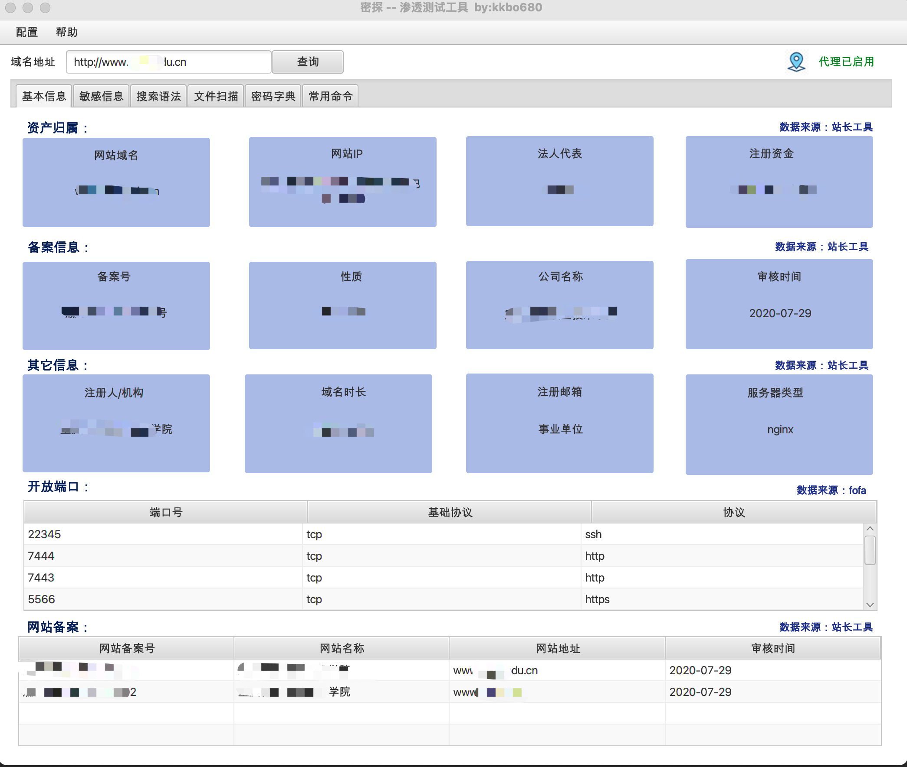
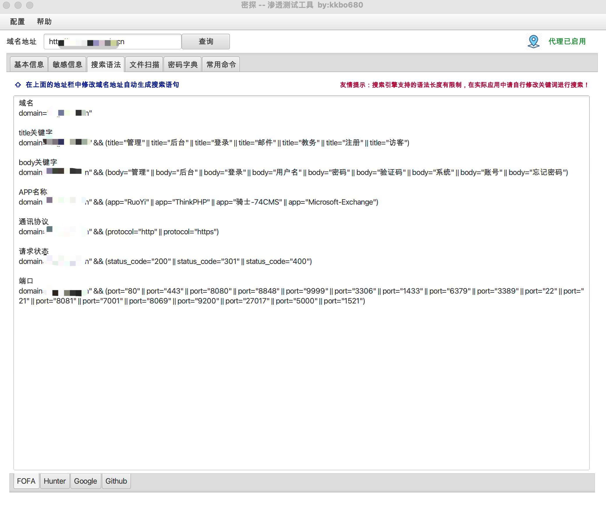

## 密探 -- 渗透信息收集工具

### 1.缘起

对于网络安全的小白来说，渗透测试过程中，需要一款好用的渗透测试工具，通过学习和实践，借鉴superSearchPlus (不会安全的开发)的，御剑文件扫描等工具，再根据自己的喜好，开发这款“密探”渗透信息收集工具

### 2.功能介绍

  密探-主要包含域名信息查询，IP端口查询，备案信息查询，搜索引擎语法自动生成（FOFA,Hunter,google,github），文件扫描（包含目录，备份文件，spring信息泄漏，自定义字典等）。

###  3.已完成功能

-   **信息搜索**

-  **搜索语法生成**

- **文件扫描功能**（支持单一地址扫描也支持批量扫描 ，扫描字典支持默认字典，也支持自定义字典）

### 4. 互相交流

 密探渗透工具在开发过程中得到“长风安全”，“湘安无事“两个团队的师傅对工具的完善提供大量帮助，后续等待开发完成在团队内部测试后，提供免费下载使用。有更好的想法也可以➕V：kkbo680  提供宝贵意见。 