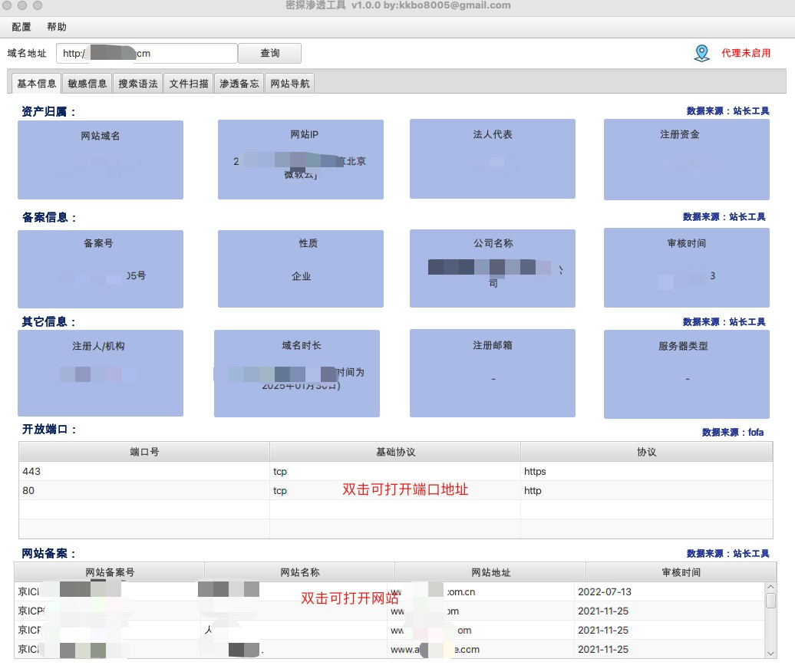
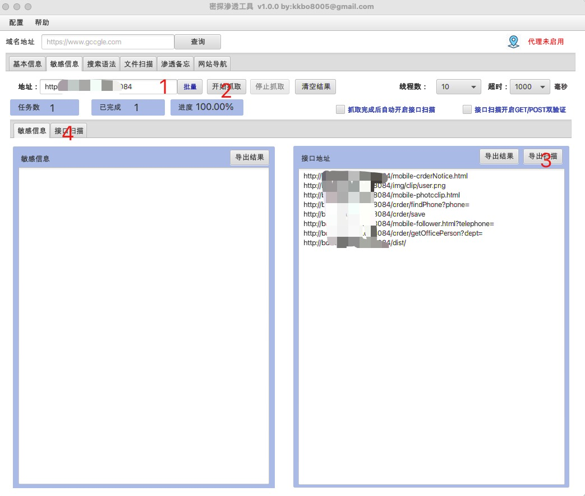
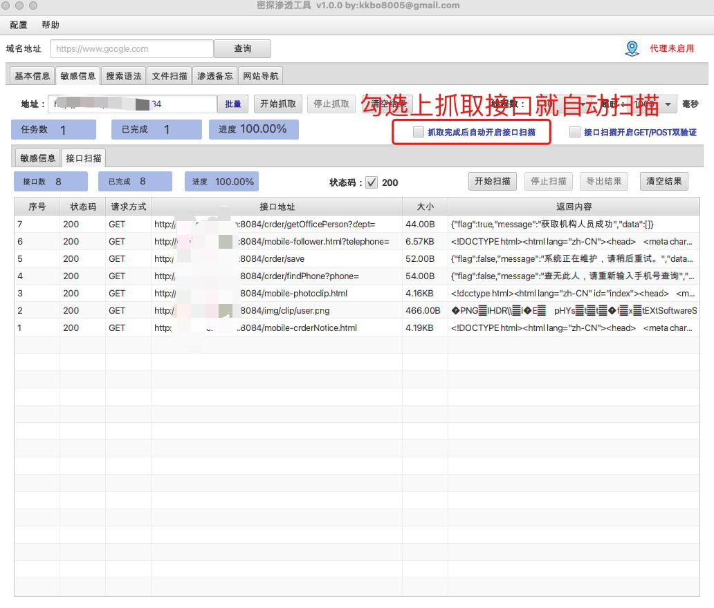
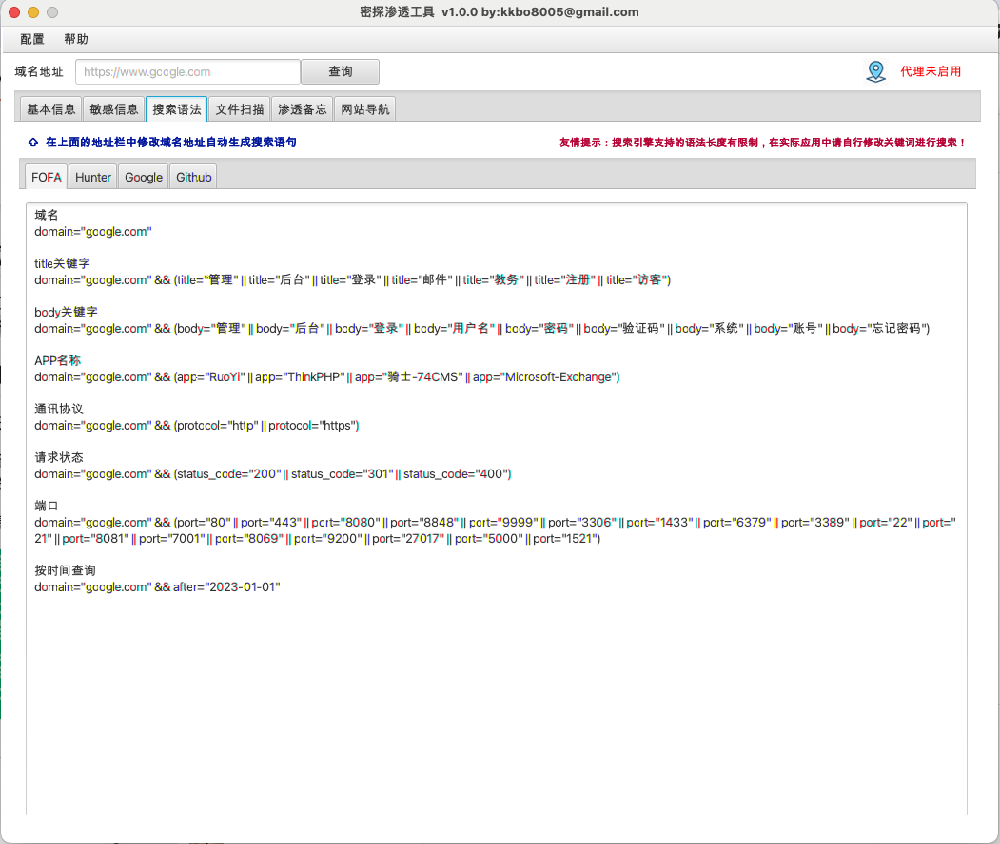
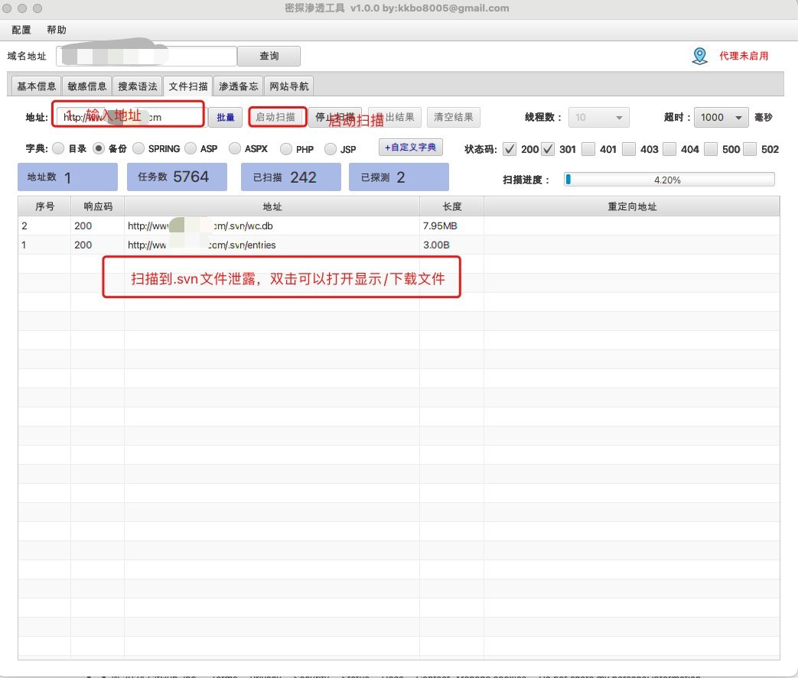
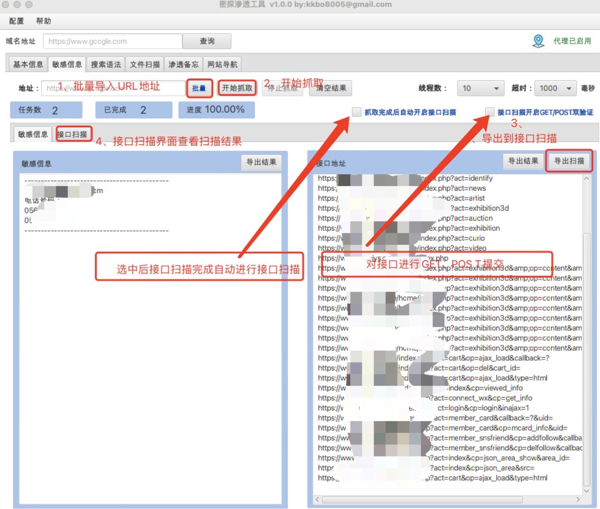
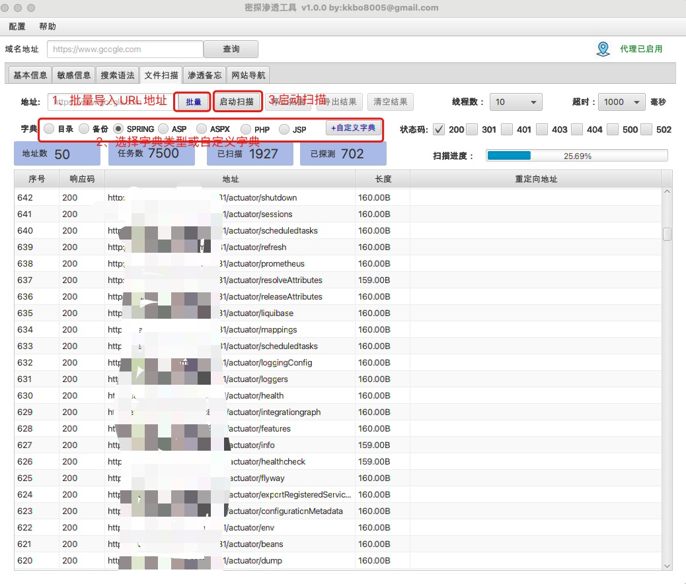
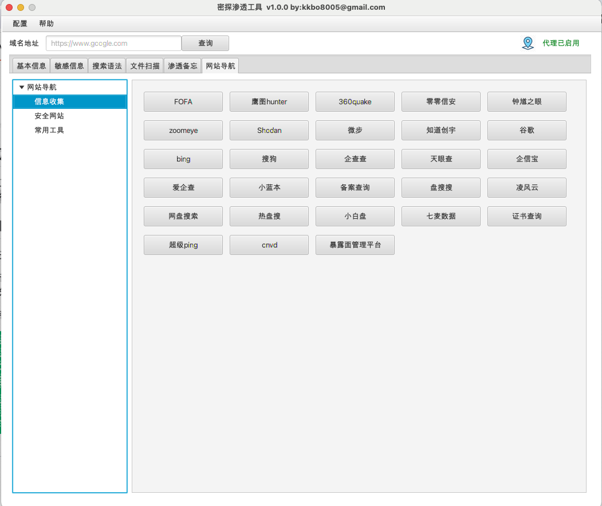

# 1、密探简介

## 1.1 密探介绍

​       **密探-主要包含域名信息查询，IP端口查询，备案信息查询、敏感信息（接口探测），搜索引擎语法自动生成（FOFA,Hunter,google,github），文件扫描（包含目录，备份文件，spring信息泄漏，自定义字典等）、渗透技能备忘录，常用网络安全网站导航等功能。**

## 1.2 使用声明

​       **本工具仅供安全测试人员运用于授权测试, 禁止用于未授权测试, 违者责任自负。作者不对您使用该工具所产生的任何后果负任何法律责任。**  

​       **本工具在扫描模块使用多线程，在测试过程中根据目标的实际情况进行调整，切勿进行大线程低延时的大规模快速扫描，以免对目标服务造成不利影响。**

#  2、使用说明

## 2.1 如何运行

   在JDK 8环境下运行以下语句：

```
java -jar mitan-1.0-jar-with-dependencies.jar
```

##  2.2 使用场景

### 2.2.1  单一目标

#### （1）基本信息

  在主界面的域名地址的地方输入需要查询的目标地址，点击查询，显示该目标的基本信息。



#### （2） 敏感信息（接口未授权扫描）

   单一目标的敏感信息抓取地址会自动从主界面中带过来，然后点击抓取，就抓取该地址的敏感信息及接口地址，点击“导出扫描”后，在“接口扫描”界面进行接口扫描探测。





#### （3） 搜索语法

​    为了避免对搜索语法不熟悉，在实战过程中毫无头绪，搜索语法模块对常用的***FOFA，Hunter，GOOGle，GitHub***的搜索语法进行了归纳，便于实战中快速进行资产收集。



#### （4）文件扫描

​      单一目标的文件扫描地址会自动从主界面中带过来，选择好字典就可以进行文件扫描。



### 2.2.2 批量目标

​    批量目标的应用场景主要就只包含敏感信息扫描（未授权接口）、文件扫描两个功能。界面跟单一目标的一致，操作雷同，就简单付图说明：

#### （1）敏感信息（接口未授权扫描）



#### （2）文件扫描



## 2.3 辅助功能

#### （1）、渗透备忘录

主要想把一些常用的手法、技巧整理整合，便于渗透的时候查漏补缺，取得更好的渗透效果


#### （2）、常用网站导航



# 3、致谢

  作者在开发过程中使用并借鉴了很多大佬们开发的工具，在这里统一表示感谢。他们包含FindSomeThing、SuperSearchPlus (不会安全的开发)，御剑文件扫描、dirsearch、JSFinder,fofaviewer等，感谢你们，你们太棒了。

   同时密探工具在开发过程中，“**长风安全**”，“**湘安无事**“两个团队的师傅们提供了大量帮助，在此表示感谢。

# 4、交流

  密探1.0版本是在作者边学边写的基础上产生的、还比较粗糙，希望大家多多帮助，不断完善提升，同时建立了用户使用群，大家一起交流使用中遇到的问题。感兴趣的师傅➕V：kkbo680 ，拉群交流。


