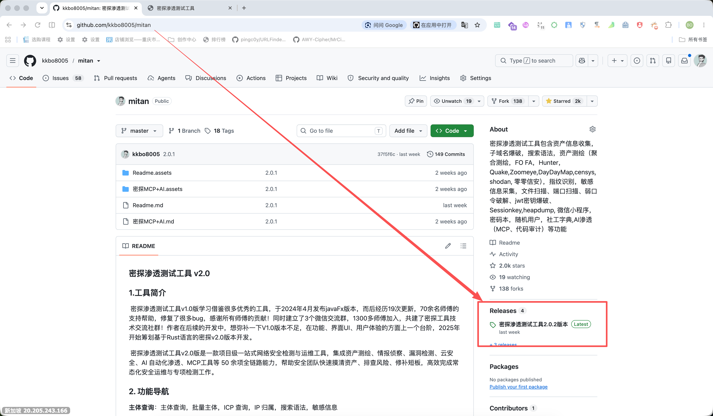
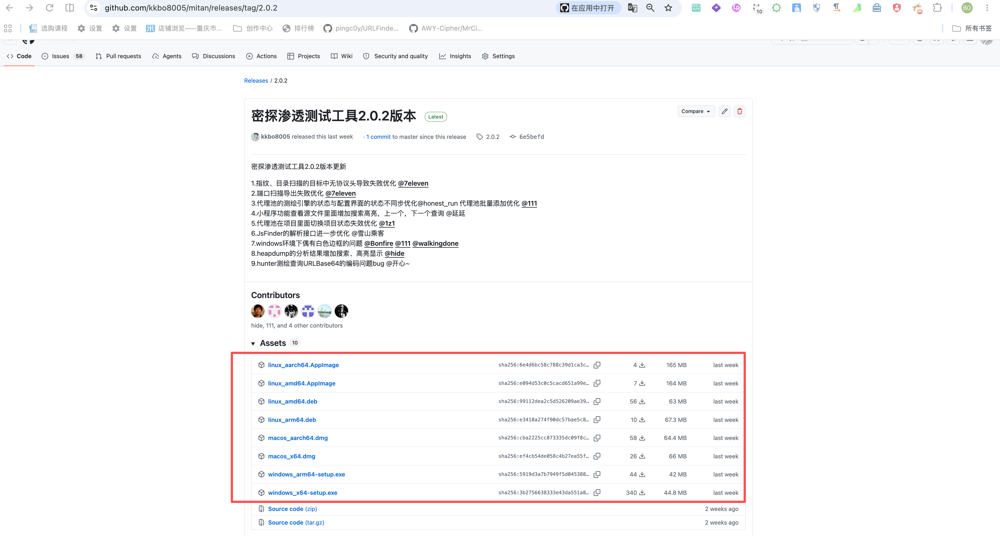
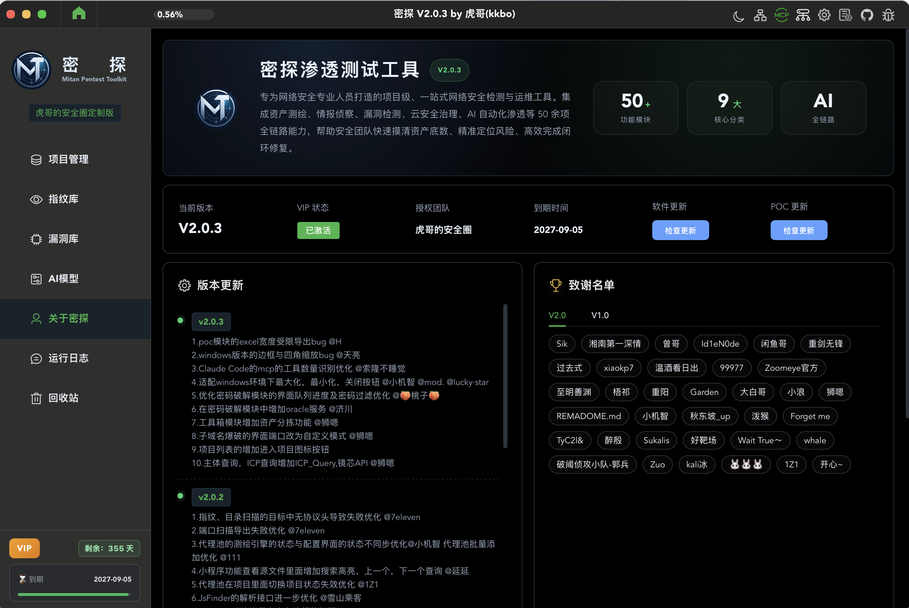
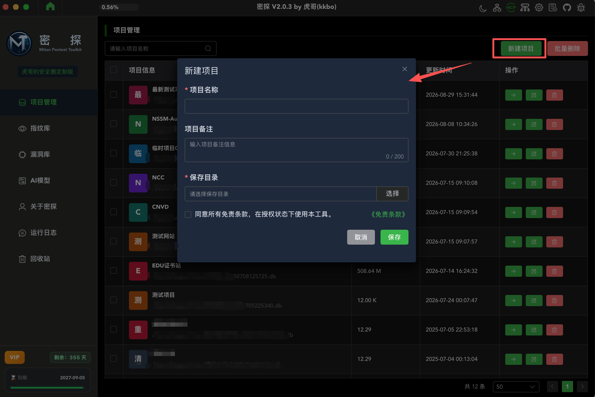
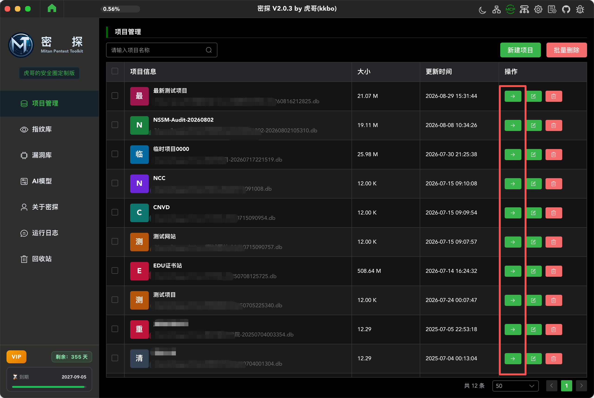
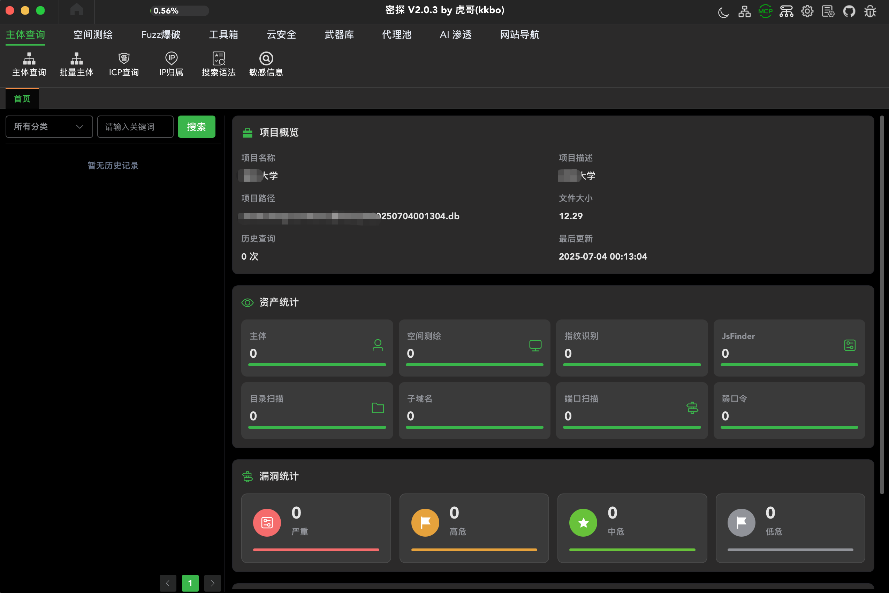

## 1. 如何下载密探？

对于不熟悉github的师傅，先看看说明。

1.你进入了https://github.com/kkbo8005/mitan 的界面后，点击后侧的release进入后，页面就是最新的下载界面，根据您的操作系统架构选择合适的版本下载使用。





选择对应的系统架构安装包下载后按照即可

## 2. 如何安装密探？

#### **(1) 在windows环境使用**（windows11以上）

**在windows环境下安装使用过程中如果遇到杀毒软件报毒，可以比对一下本地的安装包或程序与github上hash是否一致，如果确认是官方安装文件，即可设置软件白名单，放行运行**。

- **系统无webview2，安装webview失败**

系统运行依赖webview2，如果没有webview2环境，安装程序会引导下载安装，若卡主不动，可以手动安装。

webview2下载安装地址：

https://developer.microsoft.com/zh-cn/microsoft-edge/webview2?form=MA13LH#download

请根据自己的系统选择下对应的安装程序。


#### **(2) 在MAC环境下使用**

macOS版本如出现“密探.app已损坏,无法打开”是因为程序没有苹果签名，解决方法控制台：

允许安装第三方来源APP：

```
sudo spctl --master-disable
```

删除程序隔离属性：

```
sudo xattr -r -d com.apple.quarantine /Applications/密探.app
```

#### **(3) 在Linux环境下使用**

- **AppImage文件运行方式：**

第一步先授予权限

```
chmod +x mitan_linux_aarch64.AppImage
```

第二步：命令行的方式启动运行

```
./mitan_linux_aarch64.AppImage
```

第二步：图形界面设置权限（双击启动运行）

```
 mitan_linux_aarch64.AppImage文件 → 右键 → 属性 → 切换到「权限」→ 标签✅勾选：允许将文件作为程序执行关闭属性窗口，现在就可以双击图标启动
```

-  **Deb文件运行方式：**

第一步：根据您系统的架构选择对应的安装文件，以下以arm64的deb文件

```
sudo dpkg -i Linux_arm64.deb
```

第二步：直接运行在控制台输入mitan完成工具启动

```
mitan
```

如果正常的话，会立即显示出来工具界面

## 3.如何使用密探？

### （1） 主界面

成功安装后，显示“密探”的主界面。



### （2）新建项目

第一次使用需要创建“项目”，点击右侧的“新建项目”后，点击“->"进入项目图标（或则点击项目行）进入项目界面。







### （3）具体密探的功能介绍

   录了一个简单的视频放到b站，需要的师傅可以点击查看

【密探渗透测试工具2.0介绍】 https://www.bilibili.com/video/BV1AkY46NEKz/?share_source=copy_web&vd_source=54cb0568fcea2b24aca7fc151005d590


