温馨前置提醒：**所有渗透测试、漏洞挖掘操作，必须拥有目标系统正式书面授权，严禁对未授权资产开展探测、扫描、漏洞利用，违反《网络安全法》《刑法》相关规定，一切非法操作后果自行承担。下文仅作安全技术交流、授权范围内合规测试思路参考。**

### 1.前言

​       各位师傅，当下 AI 能力迭代速度很快，输出效果经常超出预期，AI 工具热度持续走高。不少人都在思考：如何利用 AI 辅助漏洞挖掘，怎么结合**密探**这类测绘 / 资产探测工具放大渗透战果、提升测试效率。今天以腾讯的workbuddy为例子(其他的工具如TRAE配置方式都是一致的）完整梳理一套「AI + 密探」联动，从信息收集到渗透测试落地的完整操作流程。

### 2、整体思路

密探核心价值：**资产测绘、端口探测、服务识别、漏洞标签、域名 / 子域名、备案信息、网络空间资产快速检索，弱口令探测等**，负责把互联网上的目标资产 “找出来”；

AI 核心价值：**情报梳理、筛选有效资产、生成探测策略、漏洞思路推演、Payload 整理、数据分析等**，负责把杂乱数据 “加工成可用攻击思路”。

简单总结：**密探负责抓原始资产数据，AI 负责筛选、分析、规划测试路径，二者互补，减少大量人工重复工作。**

**整体链路：**

目标范围定义 → 密探批量资产采集 → AI 清洗筛选高价值资产 → AI 生成针对性探测方案 → 密探定向深度扫描 → AI 分析扫描结果、识别潜在漏洞线索 → AI 辅助漏洞验证思路、构造测试语句 → 漏洞验证、痕迹整理 → AI 自动生成渗透测试简报

### 3.MCP配置

（1）密探开启MCPServer服务

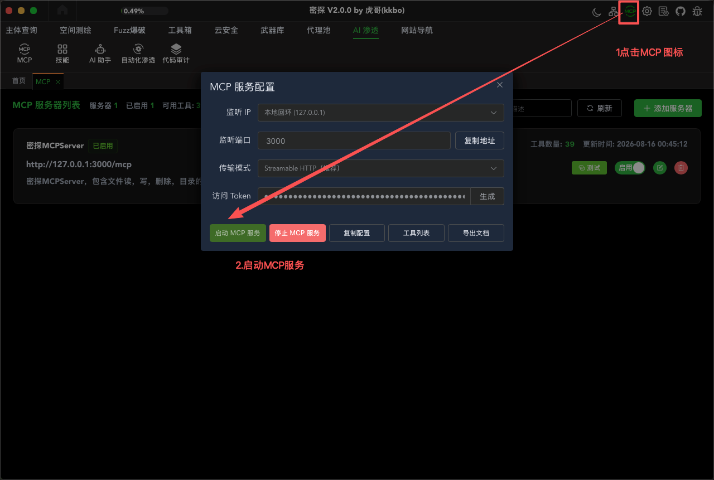

（2）复制MCP Server的配置

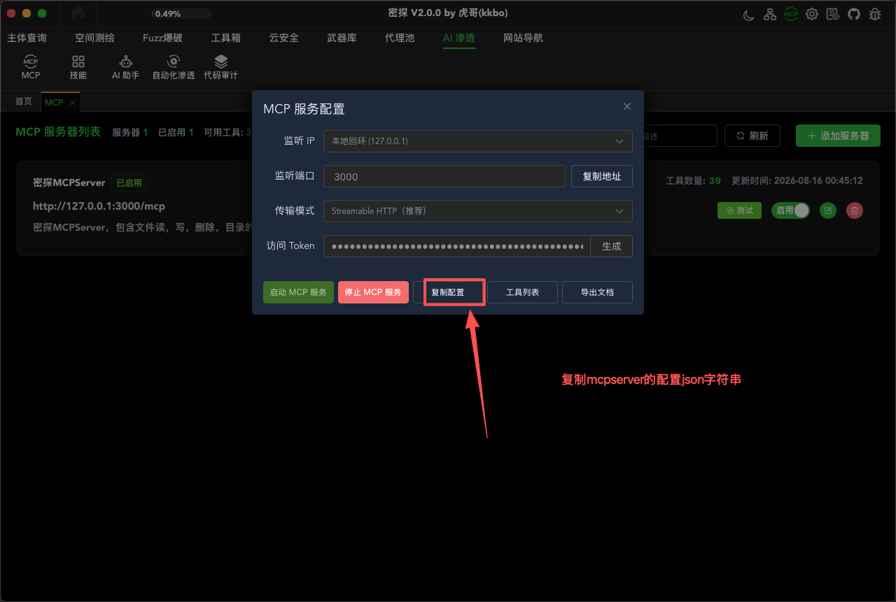

（3） 打开Workbuddy选择连接器

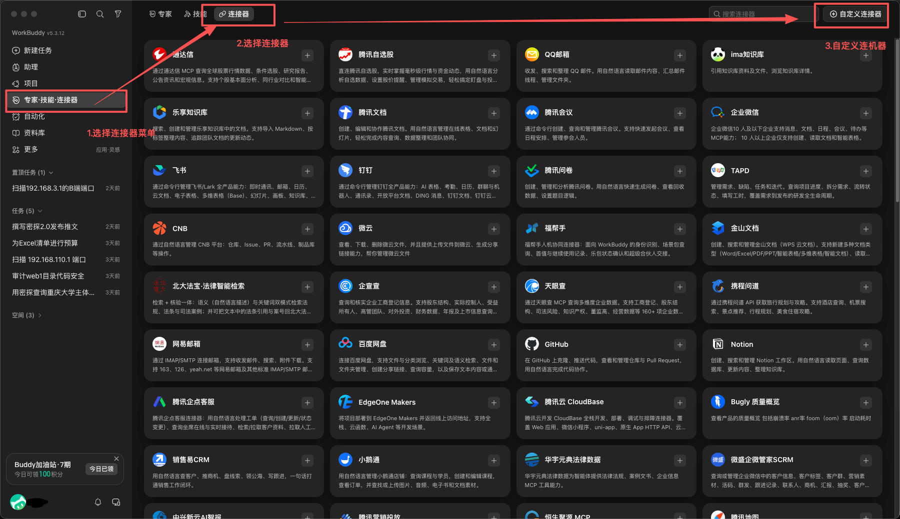

（3） 配置MCP

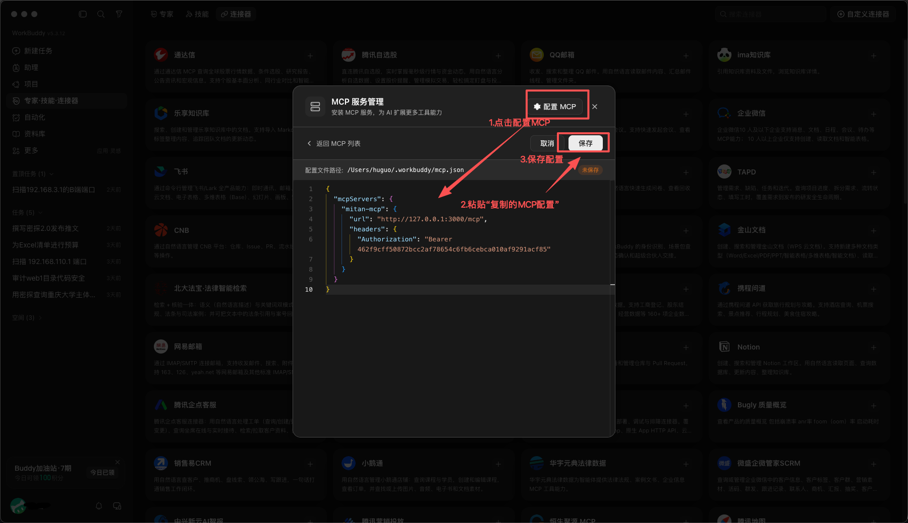

（4） 测试MCP连接状态

首次配置的时候需要点击"信任",点击后，看到下面的工具列表出来了，就表示MCP已经配置完成，可以在AI客户端实现与MCP的交互了。

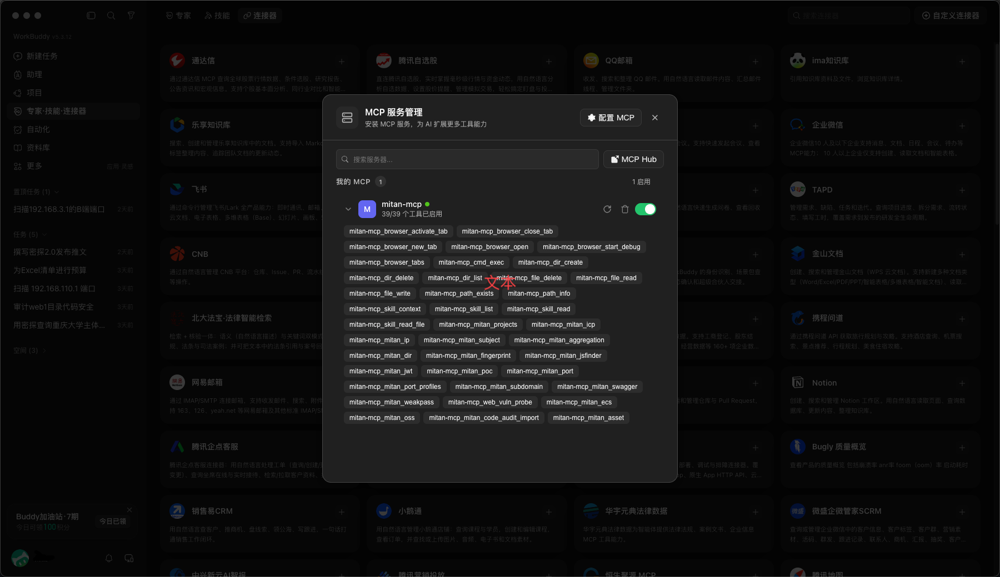

### 4.AI+MCP实例

##### （1） 项目选择

   由于密探是以项目为基础来管理渗透测试数据，AI与MCP交互的数据都会保存到对应的项目库中，便于后续对已经产生的数据进行统一管理，所以在首次与AI交互的时候，AI会先请求MCPserver获取项目列表，用户选择项目后，继续完成后续的交互。
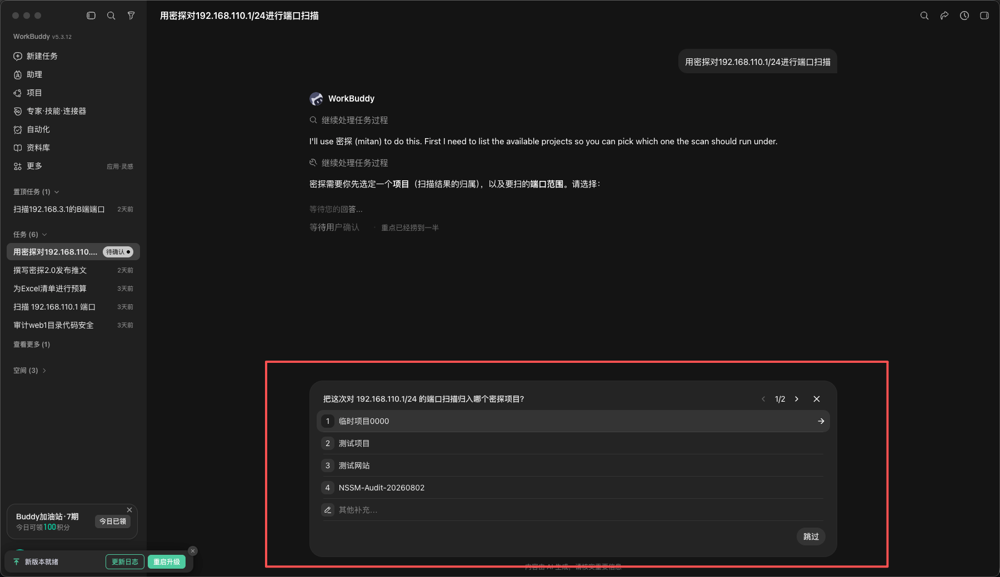

##### （2） 对于资产主体信息查询

  拿到授权测试范围（公司域名、IP 段、备案主体构名称），先交给 AI，下达提示词：

```
使用密探工具对已授权的主体XXX公司进行主体查询
```

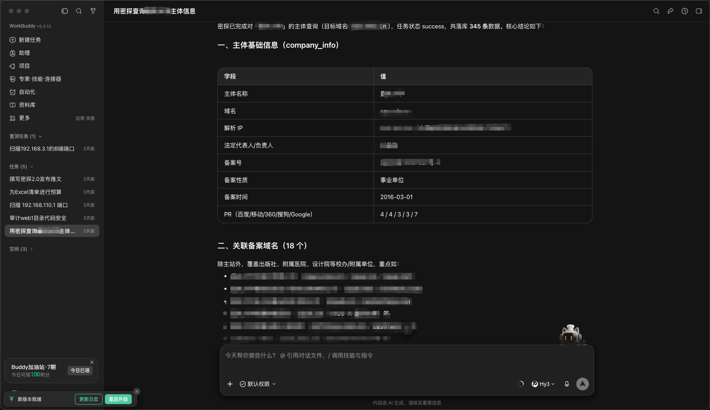 

##### （3) 对于资产的网络资产测绘

拿到授权测试范围（主体、域名、IP等），先交给 AI，下达提示词：

```
已知目标主体 重庆大学，授权测试范围：cqu.edu.cn。请结合网络空间测绘语法，通过密探工具完成域名+title为系统的资产测绘。
```

AI会提示用户选择需要测绘的网络引擎。

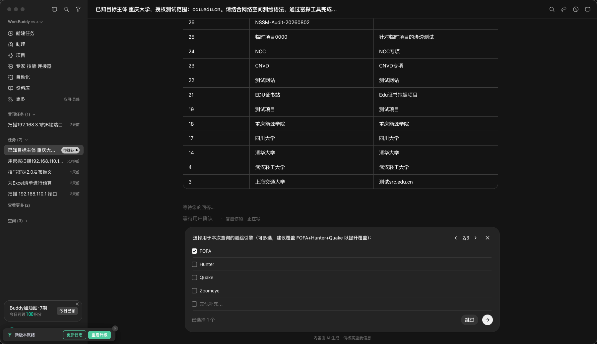

选择引擎以后，会提示用户需要查询的数据条数，默认为500条。

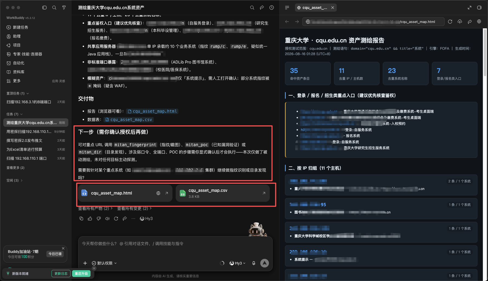

AI Workbuddy 在密探返回结果后，会生成html的报告，并且根据密探工具的功能提示下一步的指纹识别，漏洞检测，目录扫描等操作。  

##### (4)  对IP进行端口扫描

拿到授权测试范围（IP或IP段），先交给 AI，下达提示词：

```
请用密探对 192.168.110.1/24 进行端口扫描
```

开始扫描，AI会根据密探设置的字典，提示用户选择用什么字典进行扫描。

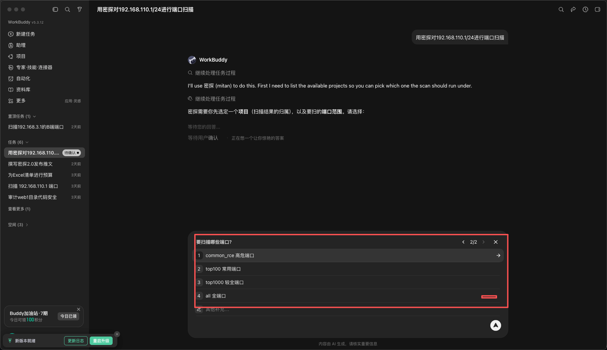

扫描完成后，AI会自动分类形成报告

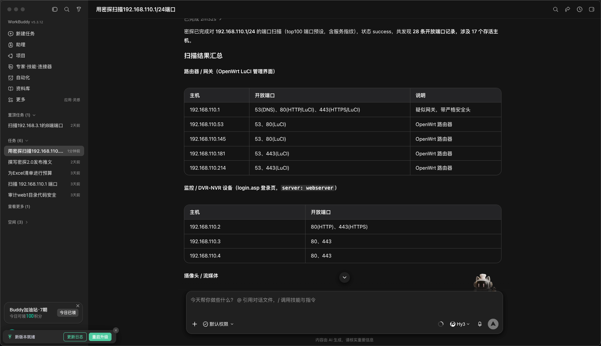

#####  （5) 对URL进行敏感信息提取

拿到授权测试范围（URL），先交给 AI，下达提示词：

```
请用密探对http://192.168.3.4:8080进行js敏感信息提取
```

AI会调用密探的jsfinder工具对目标URL进行API,URL,aksk泄露等敏感信息进行提取。

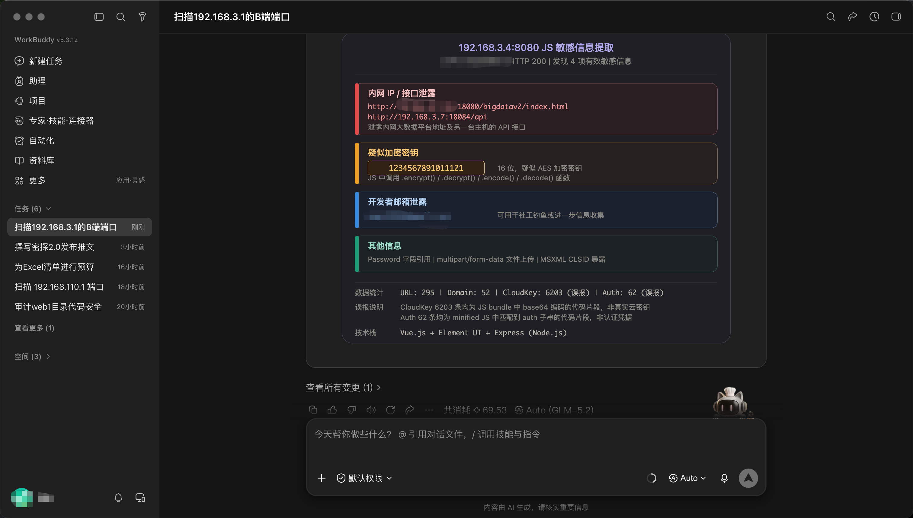

#####  （6) 对IP或IP段进行弱口令扫描

拿到授权测试范围（IP或IP段），先交给 AI，下达提示词：

```
请用密探对192.168.3.1/24 进行弱口令探测
```

AI会调用密探的弱口令扫描工具完成弱口令扫描，扫描完成后形成汇总信息

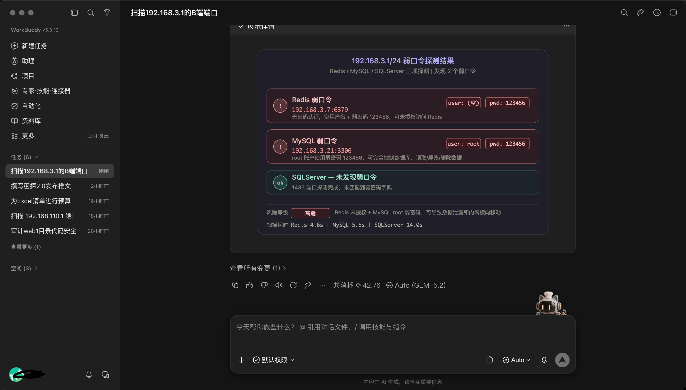

#####  （7) 对URL进行目录扫描

拿到授权测试范围（URL），先交给 AI，下达提示词：

```
请用密探对http://192.168.3.1 进行目录扫描
```

AI会调用密探的目录扫描工具，提示用户选择扫描字典，后完成目录扫描，扫描完成后形成汇总信息

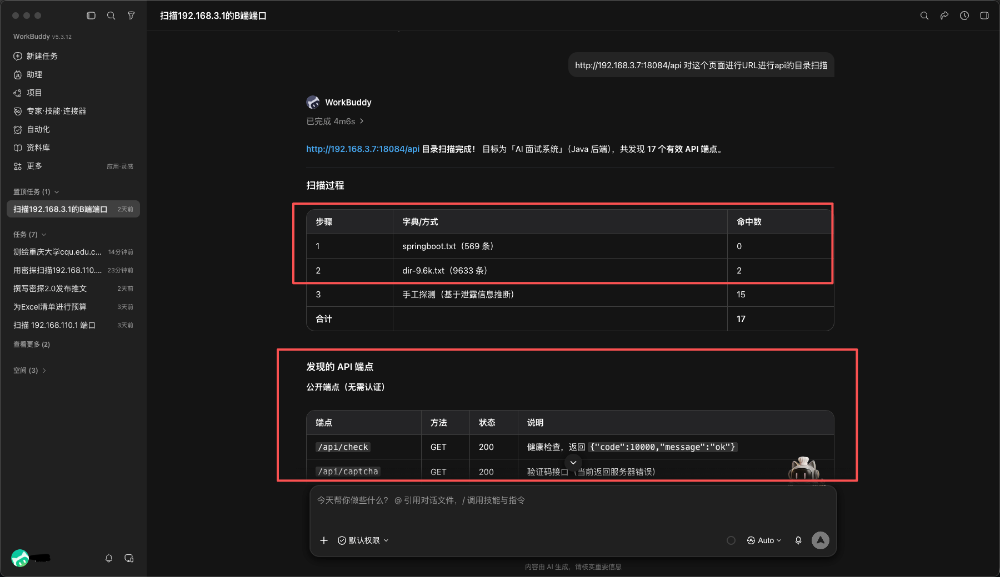

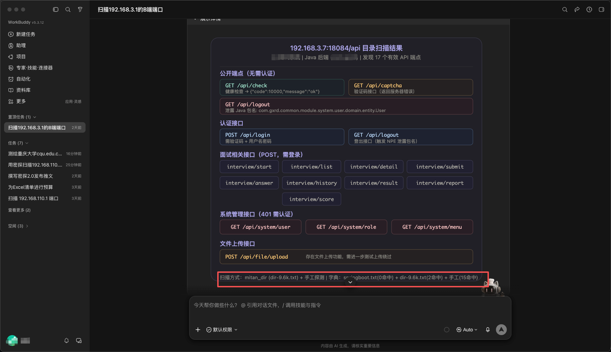

#####  （8) 对URL进行POC漏洞扫描

拿到授权测试范围（URL），先交给 AI，下达提示词：

```
请用密探对http://192.168.3.100:9000 进行POC漏洞扫描
```

AI在POC扫描的之前会提示用户扫描的指纹或POC关键词，然后根据条件搜索对应的POC对目标进行POC漏洞验证。

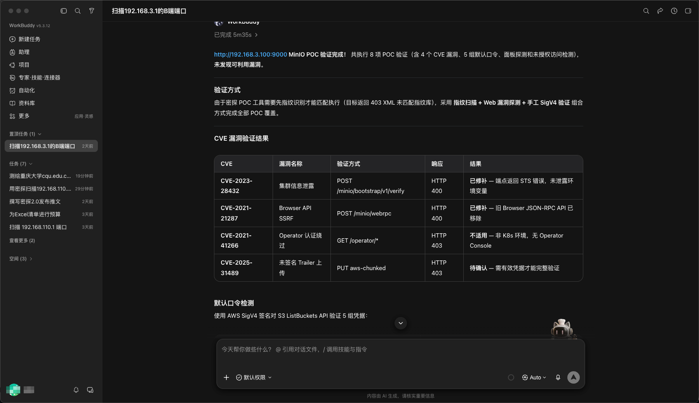

扫描完成后，AI会根据扫描结果返回漏洞扫描报告
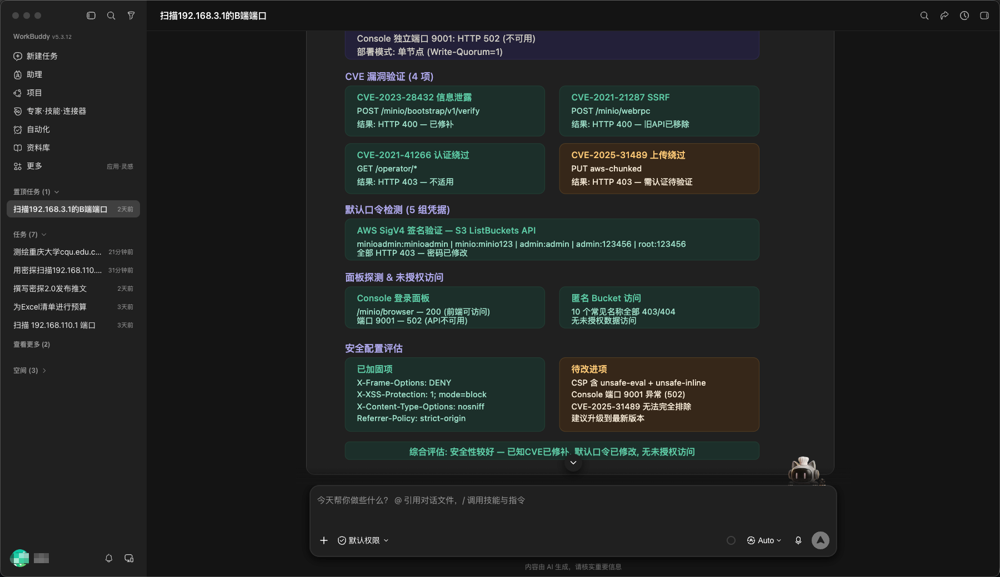


### 5.AI+密探MCP服务的优势

**（1）无需手动查询、自然语言完成资产收集**

人工写测绘语法、筛选几百上千条资产、分析海量扫描日志极其耗费精力，AI 承接筛选、整理、文案工作；

**（2） 拓宽漏洞挖掘思路**

单一依靠经验容易存在思维盲区，AI 能够结合海量漏洞知识库，针对不同组件给出多条渗透路径，更容易发现意料之外的测试点；

**（3）AI 负责深度思考，密探负责干活**

密探优势是大范围全网资产摸排；AI 擅长信息推理、策略规划，二者结合，实现 “广撒网 + 精准打击”，有效扩大渗透战果；


> AI客户端的每一次的表现都可能有差异，展现出来的结果不一定与作者的例子一致，最终以AI客户端的表现为准。作者只是提供当时测试环境下的AI客户端表现。